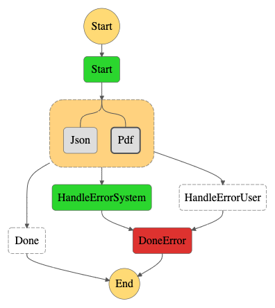
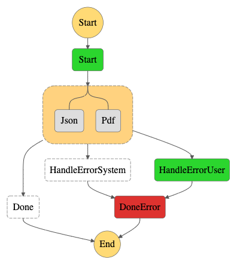
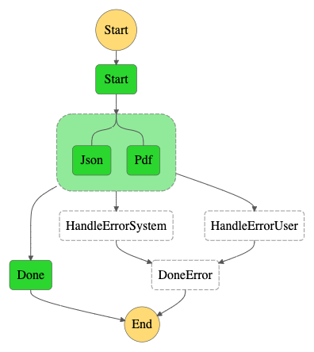

=======================
 README Parallel Error
=======================

A Demonstration.

We want a Parallel task to wrap two functions, one that computes JSON
output, the other computes PDF output.

If they both succeed, we go to the successful Done state.

If either raises an UserException or SystemException, we should trap
it outside of the Parallel task and send it to the correct failure
processor, both of which flow to a DoneError terminal failure state.

When you deploy this, it will create a Step Function state machine and
two Lambda functions; the Lambdas randomly choose an error or
success. When you Execute it in the AWS console, you can see it taking
different paths, with the errors caught by the Parallel Task, then
routed to the correct handler. You can inspect the Input and Output of
the states to see what function caused which error.

The diagrams below are from the Step Functions console and show the
three different possible execution workflows.

