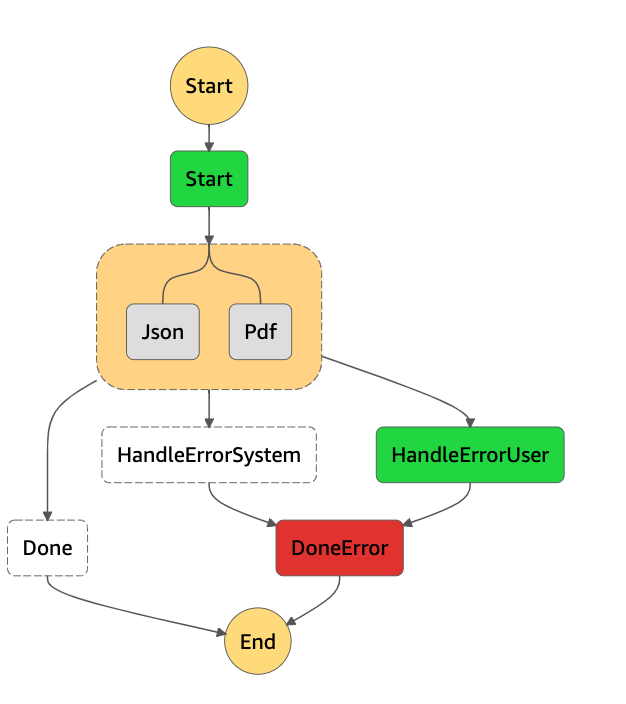

=======================
 README Parallel Error
=======================

Demonstration.

We want a Parallel task to wrap two functions, one that computes Json
output, the other cmoputes PDF output.

If they both suceed, we go to the successful Done state.

If either raises an UserException or SystemException, we should trap
it OUTSIDE of the Parallel task and send it to the corred failure
processor, which both then flow to a DoneError terminal failure state.

